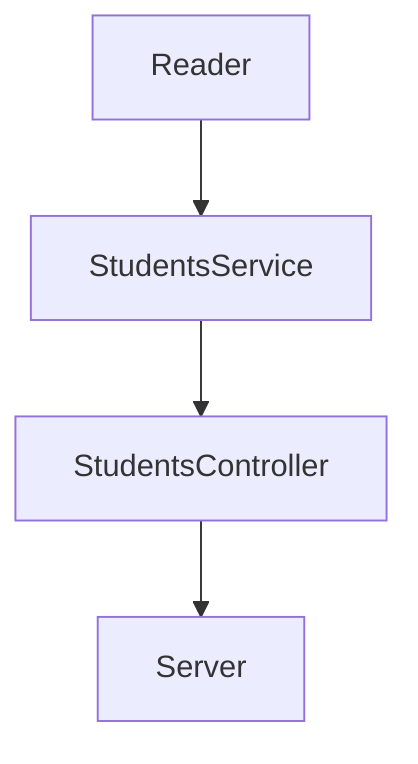

# Code_Challenge

### Dependencias utilizadas en el proyecto.
| Dependencia  | Instalación | ¿Para qué se utiliza? |
| ------------- | ------------- | ------------------ |
| Express  | npm install express --save  | Nos permite crear una Api para aplicaciones Web usando javascript. |
| Jest  | npm install --save-dev jest  | Nos permite hacer test para validar los métodos hechos con javascript. |
| ESLint | npm install eslint --save-dev | Encuentra y resuelve los errores estéticos del código en javascript. |

### Para este proyecto se crearon los siguientes archivos:

____________________________________________________________________________________________________________________
`Reader.js` : archivo ubicado en `./lib/utils/Reader.js`, contiene un método llamado `readJsonFile`, el cuál, 
su función es leer un archivo tipo json y regresar los datos encontrados, para ello se necesita de el módulo `fs`
ya que permite acceder e interactuar con los archivos.
____________________________________________________________________________________________________________________

`StudentsService.js`: ubicado en `./lib/services/StudentsService.js`, este archivo contiene 3 métodos:

 * `getAllStudents` : Utiliza el método `readJsonFile` de la clase `Reader` para leer el archivo `students.json`
                      y regresa la información obtenida.
     
     
                      
 * `getEmailsByHaveCertification` : El fin de este método es regresar los `email` de aquellos estudiantes que
    cuanten con certificación, para ello se obtiene la información de los estudiantes (`students.json`) y se
    hace un filtro para que regrese la información de los estudiantes con certificación, finalmente, con la 
    función `map` se regresan solo los `email`.
    
      
 
 * `getStudentsByCredits`: Este método obtiene la información de todos los estudiantes utilizando el método 
    `readJsonFile` de la clase `Reader` y filtra los resultados basándose en si el campo `credits` es mayor 
    al parámetro que se le manda (por ejemplo 500), y regresa los datos de los estudiantes que cumplen con
    esa condición.
    
    
    
Para poder acceder a la clase `Read` es necesario "importarlo" en StudentsService.js de la siguiente manera (CommonJs):

   > const Reader = require("../utils/Reader");
__________________________________________________________________________________________________________________________

`StudentsController.js`: ubicado en `./lib/controllers/StudentsController.js`, este archivo contiene 3 métodos:

 * `getAllStudents` : Llama al método `getAllStudents` de la clase `StudentsService` y regresa la información obtenida.
     
     
                      
 * `getEmailByHaveCertification` : Llama al método `getEmailsByHaveCertification` de la clase `StudentsService` 
    y regresa la información obtenida.
    
      
 
 * `getStudentsByCredits`: Llama al método `getAllStudents` de la clase `StudentsService` y le manda como parámentro
    su parámetro credits, finalmente regresa la información recibida.
    
    
    
Para poder acceder a la clase `StudentsService` es necesario "importarlo" en StudentsController.js de la siguiente manera (CommonJs):

   > const StudentsService = require("../services/StudentsService");

______________________________________________________________________________

`server.js`: ubicado en `./lib/server.js`, este es el archivo con el que se crea oficialmente el API, se necesita "importar" la clase `StudentsController`, también se importa el modulo `express`.

Con express se pueden crear los `endpoints` que se necesiten sin importar el tipo (`GET`, `POST`, `PUT`, `DELETE`). Para este proyecto solo se utilizará el método `GET`.

Guardamos la `App de Express` en la constante `app`, y guardamos en la constante `port` el puerto donde se va a correr el `API` (3000). 

Para que se pueda levantar el servicio, es necesario que la `App de Express` "escuche" el puerto, eso se hace de la siguiente manera.

Se declararon 3 rutas (endpoints) con el método `GET`, una para cada método de StudentsController.

| Endpoint | Request | Response |
| -------- | ------- | -------- |
| localhost:3000/v1/students | localhost:3000/v1/students | Regresa la información de todos los estudiantes |
| localhost:3000/v1/students/emailByHaveCertification | localhost:3000/v1/students/emailByHaveCertification | Regresa los correos electrónicos de los estudiantes que tienen certificación |
| localhost:3000/v1/students/credits/:credits | localhost:3000/v1/students/credits/500 | Muestra los datos de los estudiantes que tienen más de 500 créditos |

Para correr el API se necesita ejecutar el comando `npm run server`, el cuál se declaró en el `package.json` que al correr ese comando es como si corriera `node ./lib/server.js`. 

Una vez levantado el `API`, vamos al navegador y accedemos a las rutas que se habilitaron en el `server` (pueden usar las rutas que se encuentran en la columna `Request` de la tabla anterior).

| Código | Respuesta en el navegador |
| ------- | -------- |
|  |  |
|  |  |
|  |  |

_______________________________________________________________________________________________________________

Como todo sistema, se crearon test para validar que ni los métodos de `StudentsService` y `StudentsController` regresaran datos incorrectos.

* Tests para la clase StudentsService (`./test/services/StudentsService.test.js`).

  

* Tests para la clase StudentsController (`./test/controllers/StudentsController.js`).

  

Para correr los test es necesario utilizar `jest`, en el `package.json` se agrega un script con la ruta de `jest` para que al ejecutar el comando `npm test` corran los test.

__________________________________________________________________________________________________________________

Así mismo, en el `package.json` se declaran scripts para hacer uso de ESLint y poder corregir el código del sistema que esté escrito con javascript.

El comando `npm run linter` nos muestra los errores que encontró en el código, `npm run linter-fix` corrige algunos de dichos problemas (como agregar ';' al final de las líneas).
____________________________________________________________________________________________________________________
